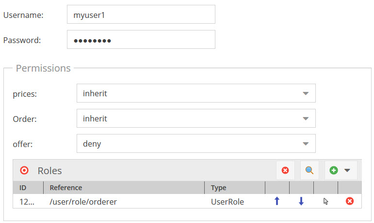

# FrontendPermissionToolkit 

Adds some helpers to define permissions for users in websites based on Pimcore objects.
So user permissions for complex systems can be defined directly in Pimcore objects.  

A scenario to setup a role based permission system: 
- user represented as objects with a number of permission rights (= Permission Resources)
- each user has relations to user groups (also Pimcore objects) with also a number of permission rights (= Permission Resources)



### Functionality overview
- Additional data types for Pimcore objects
  - Permission Resource:
     - represents one specific user right (e.g. login) 
     - can have values ```allow``` ```deny``` ```inherit``` 
  - Permission Objects: Wrapper for default data type `objects` for recursive permission calculation. 
  - Permission Href: Wrapper for default data type `href` for recursive permission calculation.

- Service for checking user rights based on a Pimcore object and a permission resource as service class ```Service``` with 
  two methods:
  - ```Service::getPermissions```: 
     - returns an array of all permissions for the given object, automatically merges all permission resources of objects related to the given object with 'Permission Objects' or 'Permission Href'.
     - merging: When permission is set to allow / deny directly in object, this is always used. Otherwise optimistic merging is used -> once one permission is allowed, it stays that way.
  - ```Service::isAllowed```: checks if given object is allowed for given resource
  
  
  
The Service is registered at the container with the key `bundle.frontendpermissiontoolkit.service`. 


### Integration with Symfony Security
For how to integrate Pimcore objects with Symfony Security in general have a look at 
[Pimcore docs](https://www.pimcore.org/docs/5.0.0/Development_Tools_and_Details/Security_Authentication/Authenticate_Pimcore_Objects.html). 
  
In order to use Permission Resources in Symfony Security definition, you could export each allowed Permission Resource
 of an Pimcore object as role. 

To do so, add the trait `FrontendPermissionToolkitBundle\CoreExtensions\Traits\PermissionResourcesAsRolesTrait` to your 
 Pimcore user object and make sure there is no other `getRoles` method defined in the object. This method returns all
 Permission Resources the user is allowed prefixed with `GROUP_` to as an array. 

As a consequence, you can use Permission Resources in your access control configuration as follows: 

```yaml 
    access_control:
        - { path: ^/special-offer-page, roles: ROLE_offer }
```
    
> Note: To apply changes of permissions in the user object, the user has to logout and login again. 
  

### Integration with Pimcore navigation

To show/hide documents in navigation, you can assign Permission Resources as properties to Pimcore documents. A special
 navigation builder shipped by this bundle (`FrontendPermissionToolkitBundle\CoreExtensions\Navigation\Builder`) 
 then can show/hide documents in navigation based on the permissions of the current user. 
 
To do so, add following service definition to your application: 
 
```yaml

pimcore.navigation.builder:
    class: FrontendPermissionToolkitBundle\CoreExtensions\Navigation\Builder
    arguments: ['@pimcore.http.request_helper']
    public: false
    calls:
      - [setService, ['@bundle.frontendpermissiontoolkit.service']]
      - [setCurrentUser, ['@security.token_storage']]

```

> Make sure that you deactivate the caching of the Pimcore navigation creation!


> This only hides the document in navigation. It does not check permissions when the document is called directly via its
> url. Add an additional check into controller or access control to make sure the document cannot be called with missing 
> permissions.

