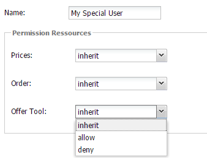

# FrontendPermissionToolkit 

Adds some helpers to define permissions for users in websites based on pimcore objects.
So user permissions for complex systems can be defined directly in pimcore objects.  

A scenario to setup a role based permission system: 
- user represented as objects with a number of permission rights (= Permission Resources)
- each user has relations to user groups (also pimcore objects) with also a number of permission rights (= Permission Resources)


### Development Instance
> http://objecttools.plugins.elements.pm/admin


### functionalities
- additional datatypes for pimcore objects
  - Permission Resource:
    - represents one specific user right (e.g. login) 
    - can have values ```allow``` ```deny``` ```inherit``` 
  
  
  
  - Permission Objects: Wrapper for default datatype objects for recursive permission calculation. 
  - Permission Href: Wrapper for default datatype href for recursive permission calculation.
- service for checking user rights based on a pimcore object and a permission resource as service class ```FrontendPermissionToolkit_Service``` with two methods:
  - ```FrontendPermissionToolkit_Service::getPermissions```: 
     - returns an array of all permissions for the given object, automatically merges all permission resources of objects related to the given object with 'Permission Objects' or 'Permission Href'.
     - merging: When permission is set to allow / deny directly in object, this is always used. Otherwise optimistic merging is used -> once one permission is allowed, it stays that way.
  - ```FrontendPermissionToolkit_Service::isAllowed```: checks if given object is allowed for given resource


### used by projects for example
- Eberspaecher (http://eberspaecher.pim.elements.pm)